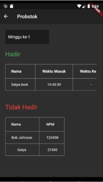
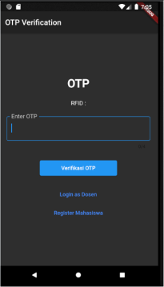
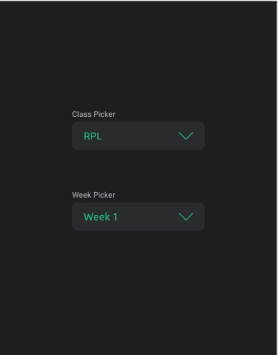
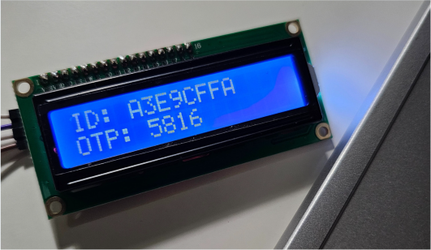
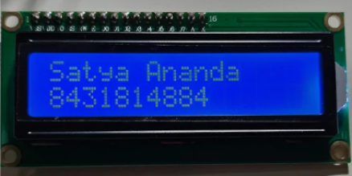
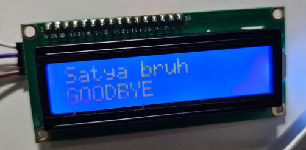

# 🚀 DanceRTOS - FreeRTOS ESP32 Attendance System

> Advanced RFID & FreeRTOS Based Attendance System with Blynk

<div align="center">
  
</div>

## 🌟 About The Project

Leveraging FreeRTOS ESP32 and RFID technology, this project offers a sophisticated attendance system integrated with a web server for efficient tracking and management, while also offering Blynk to be used by officers responsible for changing class and week the device is installed.

### 🛠️ Tech Stack

<div align="center">
  
  
  
  
  
</div>

## ⚙️ Features

- 📡 RFID integration for quick attendance recording.
- 💻 Web server functionality for remote management by lecturers. Students can also register their card and do OTP verification for attendance.
- ⏱️ Real-Time Data Processing with FreeRTOS.
- 📱 Blynk for modular positioning and weekly management

## 🚀 Getting Started

```bash
# Depends on which repository you're cloning from
# Main Repository
git clone https://github.com/cattyman919/AbsenceSystem
# OR Official Fork
git clone https://github.com/styxnanda/RTOS32-Attendance.git

# To run backend, refer to the README.md located inside ./backend
cd backend
cat README.md

# To run the frontend, refer to the README.md located inside ./frontend
cd ../frontend # Relative to ./backend
cat README.md

# To run the ESP code, open Arduino IDE and open the ./iot/ESP/ESP.ino file
cd ../iot/ESP
```

## 💡Explanation
### Hardware Design and Implementation
<div align="center">
  
</div>

For implementation of the hardware code, please refer to the [IOT directory](./iot/) . RFC522 module is used to scan the RFID cards. LCD I2C Adapter Module is used to make pin usage more efficient, by multiplexing the LCD pins into simple 4 pins.

### Network Infrastructure
<div align="center">
  
</div>

### Software Implementation Details
For details regarding the mobile application, please check the [frontend README.md](./frontend/README.md), while the features can be seen at the [backend README.md](./backend/README.md). The mobile application is used by the students to enter the class by verifying a random OTP given by the ESP32. This OTP is transported via MQTT between the student's phone and ESP32. Lecturers use the mobile application to observer the attendance log and also have the right to delete a student's attendance record. This is useful if lecturers catch a student who skips the class. Administrators can use a dedicated Blynk app to change the class and week setting of the ESP32. It can be modular if DanceRTOS is to be distributed to different classes/courses. The following image is the mobile app used by lecturer to monitor attendance.

The following images are the mobile app for lecturer to monitor attendance (left) and for student to enter OTP when entering a class (right).

<div style="display: flex">
  
  
</div>

While the following is the Blynk app used by administrator to change class and week setting of the ESP32.

<div align="center">
  
</div>

### Test Results
All acceptance criterias (refer to Powerpoint) are passed, however the performance is definitely a parameter to be heavily optimized. The HTTP requests take simply too long using even higher bandwidth Wi-Fi, including 100 Mbps. This leads to a slow response of the device.

## 📸 Device in Action

### When tapping the first time ever (student hasn't owned an account)

<div align="center">
  
</div>

### When tapping the first time to enter class (student owns an account)
Student is asked to enter the given OTP in LCD at the mobile app.
<div align="center">
  
</div>

If student enters the correct OTP, the following message appears (Name and NPM).

<div align="center">
  
</div>

### When tapping the second time to leave class
<div align="center">
  
</div>